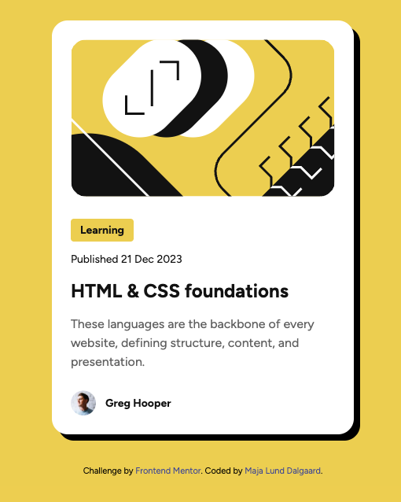

# Frontend Mentor - Blog preview card solution

This is a solution to the [Blog preview card challenge on Frontend Mentor](https://www.frontendmentor.io/challenges/blog-preview-card-ckPaj01IcS). Frontend Mentor challenges help you improve your coding skills by building realistic projects. 

## Table of contents

- [Overview](#overview)
  - [The challenge](#the-challenge)
  - [Screenshot](#screenshot)
  - [Links](#links)
- [My process](#my-process)
  - [Built with](#built-with)
  - [What I learned](#what-i-learned)
  - [Continued development](#continued-development)
- [Author](#author)

## Overview

### The challenge

Users should be able to:

- See hover and focus states for all interactive elements on the page

### Screenshot

### Links

- Solution URL: https://github.com/majdal01/blog-preview-card.git
- Live Site URL: https://majdal01.github.io/blog-preview-card/

## My process

Sketching at first on paper, trying to get the HTML5 structure in place. 
Used the design system from Figma to setup my variables.
Then - coding  

### Built with

- Semantic HTML5 markup
- CSS custom properties
- Flexbox

### What I learned

I have never used variables in simple CSS - only while using SCSS. So although this is a simple task, I am already learning.
Also only recently used clamp for responsive font in WordPress. First time using it in a coding project. 

### Continued development

I still need to be more secure about how to make the right decisions in my structure and styling.

## Author

- Frontend Mentor - https://www.frontendmentor.io/profile/majdal01

